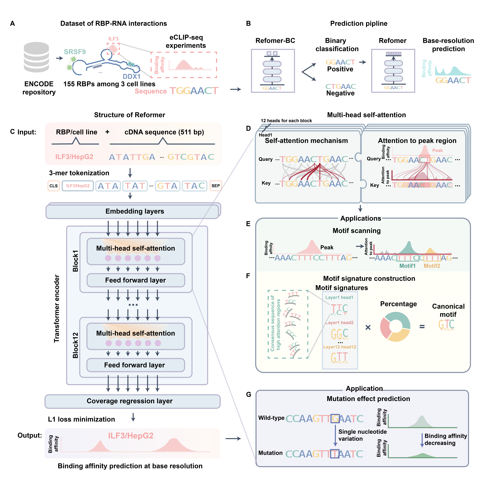

<div align="center">
<h1>🧬 Reformer</h1>
Driving interpretation of the regulation machanisms underlying RNA processing

## 📋 About <a name="about"></a>
Reformer (RNA-protein binding modeling with transformer) is a deep learning model designed for predicting protein-RNA binding affinity. The repository contains the trained model, training script, and the scripts for characterizing protein-RNA binding affinity and prioritizing mutations affecting RNA regulation.

For instructions on training models for new organisms or using the pre-trained model, refer to the installation guide.

## 🔗 Methodology <a name="methodology"></a>
Reformer is a deep learning model that quantitatively characterizes RNA-protein binding affinity at single-base resolution using cDNA sequences. Reformer was motivated by the bidirectional encoder model. We developed Reformer based on a dataset comprising 225 eCLIP-seq experiments encompassing 155 RNA binding proteins (RBPs) across 3 cell lines. The individual peaks were combined into 511 bp sequences and tokenized into 3-mer representations. The corresponding eCLIP-seq target was incorporated at the sequence beginning. The transformer layer computed a weighted sum of representations for all sequence bases, enabling Reformer to refine predictions by incorporating information from relevant regions. Employing a regression layer for coverage prediction, Reformer outputs binding affinities for all bases. The model was trained to minimize the discrepancy between the predicted and actual binding affinity.



## 📖 Installation <a name="Installation"></a>
To use the Reformer package, clone the repository:
```bash
git clone https://github.com/xilinshen/Reformer
```

Required packages can be installed using:
```bash
pip install torch transformers h5py seaborn kipoiseq biopython pysam
```

## 🌸 De novo training <a name="De novo training"></a>
For de novo training, follow these steps:
1. Create an output directory.
2. Run the training script:
```bash
python train.py \
        --outdir <output_directory> \
        --h5file <training_data> \
        --lr 2e-05 \
        --batch-size 32 \
        --epochs 30 \
        --device 0 1
```

Main function arguments:
```bash
--outdir     the output directory
--h5file     input file in h5file format (reference: "./data/example.h5") 
--lr       initial learning rate
--batch-size batch size for training
--epochs    number of training epochs
--device    list of GPU index for training
```
For a complete list of options, run python train.py -h.

## ✨ Predicting protein-RNA binding affinity <a name="Predicting protein-RNA binding affinity"></a>
To predict protein-RNA binding affinity, follow these steps:
1. Download the pretrained model from xx.
2. Prepare an h5file format input (reference: "./data/test.h5"):
 - `prefix`: RBP target and cell line name
 - `code_prefix`: coded target name (refer to "./data/prefix_codes.csv")
 - `seq`: sequence for prediction
 - `strand`: strand for prediction

** Example usage: **
```bash
import pandas as pd
import numpy as np
import h5py
import transformers as T
import torch
import tqdm
from utils import *

np.random.seed(42)

# load model
tokenizer = T.BertTokenizer.from_pretrained("./model/") 
model = load_model(tokenizer, "./model/model.bin") # xx

# load eCLIP coverage
data = h5py.File('./data/test.h5')
strand = data['strand']
dataset = SequenceDataset('./data/test.h5', tokenizer)

# experimental coverage
experiment_coverage = (data['label'][:] * 1e4)/data['coverage'][:].reshape(-1,1) # cpm normalization
experiment_coverage = torch.as_tensor(experiment_coverage[:,1:-2], dtype=torch.float32) # we drop the edge base
experiment_coverage = experiment_coverage.abs()
for i in range(len(experiment_coverage)): 
    if strand[i] == b'-': # reverse complement
        experiment_coverage[i] = experiment_coverage[i].flipud() # flip up-to-down

## prediction
for idx in np.random.choice(np.arange(len(dataset)),10): # we randomly chose 10 data for display
    inputs = dataset.__getitem__(idx)
    output = model(input_ids = inputs.unsqueeze(0).to(model.model.device))
    output = output.detach().cpu().numpy().squeeze()
    plot_tracks({'experimental coverage':experiment_coverage[idx], "prediction":output})
    
```

## 🔍 Mutation effect prediction <a name="Mutation effect prediction"></a>
To predict mutation effects on binding affinity, perform the following steps:
1. Specify mutation sites, wild-type and mutanted bases
2. we generate wild-type sequence `ref_seq` and mutant sequence `mut_seq` centered on the mutation site
3. Specify the RBP to be predicted and the cell line (reference to `./data/prefix_codes.csv`)

** Example usage: **

```bash
import pandas as pd
import numpy as np
import tqdm
import copy
import pysam
from utils import *

## download reference genome
! wget -P ./data/ https://ftp.ebi.ac.uk/pub/databases/gencode/Gencode_human/release_24/GRCh38.p5.genome.fa.gz
! gunzip ./data/GRCh38.p5.genome.fa.gz

fasta = pysam.FastaFile("./data/GRCh38.p5.genome.fa")
tokenizer = T.BertTokenizer.from_pretrained("./model/")
model = load_model(tokenizer, "./model/model.bin")

prefix = "PRPF8_HepG2"
snp = "chrX:133985274:C>T"
strand = "-"

ref_seq, mut_seq = snp_2_seq(snp, strand, fasta)

ref_input = tokenize_seq(ref_seq,prefix,tokenizer)
mut_input = tokenize_seq(mut_seq,prefix,tokenizer)

ref_coverage = model(ref_input.to(model.model.device))
mut_coverage = model(mut_input.to(model.model.device))

ref_coverage = ref_coverage.detach().cpu().numpy()
mut_coverage = mut_coverage.detach().cpu().numpy()
```
The predict function returns to `ref_coverage` and `mut_coverage`. The mutation effect was evaluate as the changes in predicted binding affinity before and after mutation:
```bash
# mutation effect
plot_tracks_comparision({"before mutation":ref_coverage, "after mutation":mut_coverage})

calc_mutation_effect(ref_coverage, mut_coverage)
```

## 🖊️ Citation <a name="citation"></a>
Unpublished